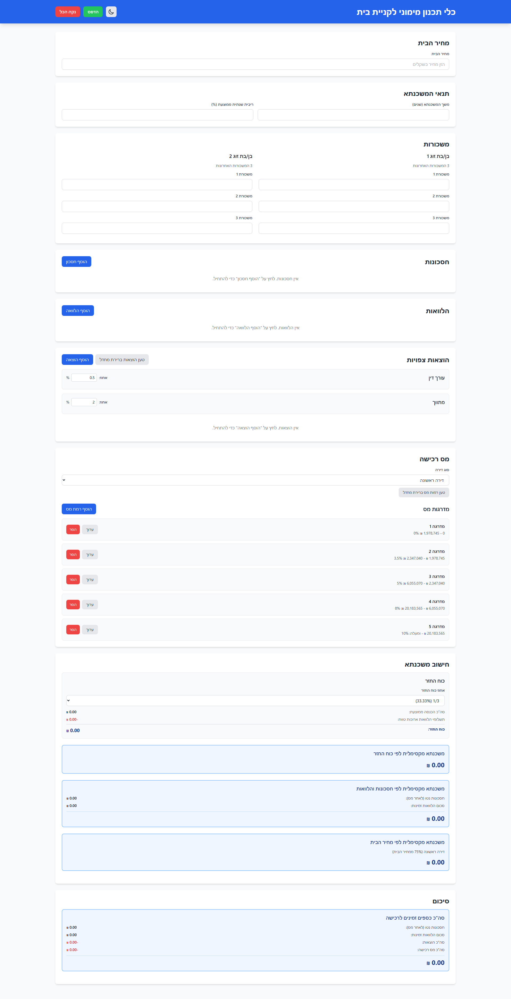
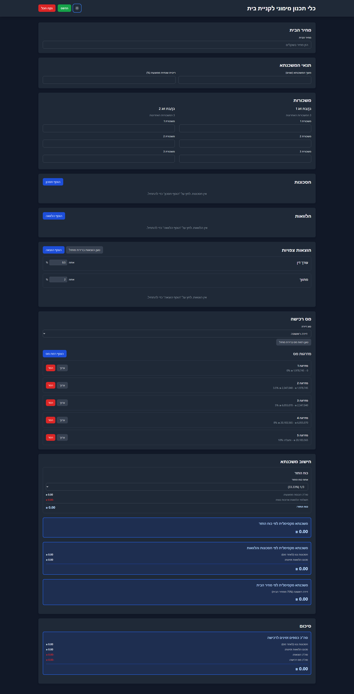

# כלי תכנון מימוני לקניית בית (Home Buying Finance Planning Tool)

כלי מקצועי לתכנון מימוני לקניית בית עם חישובים אוטומטיים ושמירה מקומית.

## תמונות מסך / Screenshots

### מצב בהיר / Light Mode


### מצב כהה / Dark Mode


## תכונות עיקריות

### הזנת נתונים
- **מחיר הבית**: הזנת מחיר הבית בשקלים חדשים
- **תנאי המשכנתא**: הגדרת משך המשכנתא (שנים) וריבית שנתית ממוצעת
- **משכורות**: הזנת 3 המשכורות האחרונות לכל אחד מבני הזוג
- **חסכונות**: ניהול חסכונות עם שם, סכום כולל, תשואה כוללת, אחוז מס, ומצב (פתוח/סגור)
- **הלוואות**: ניהול הלוואות עם שם, סכום הלוואה, משך (חודשים), תשלום חודשי, וזמינות ככוח קנייה
- **הוצאות**: ניהול הוצאות צפויות (עו"ד, מתווך, ועוד)
- **מס רכישה**: הגדרת מס רכישה (דירה ראשונה/שנייה, עד 6 רמות מס)

### חישובים אוטומטיים

#### חישוב משכנתא
- **כוח החזר**: חישוב על בסיס הכנסה ממוצעת פחות תשלומי הלוואות ארוכות טווח
- **משכנתא מקסימלית לפי כוח החזר**: חישוב על בסיס כוח החזר זמין
- **משכנתא מקסימלית לפי חסכונות והלוואות**: חישוב על בסיס סכום החסכונות והלוואות (×4)
- **משכנתא מקסימלית לפי מחיר הבית**: חישוב על בסיס אחוז מקסימלי מהמחיר (75% לדירה ראשונה, 50% לדירה שנייה)
- **משכנתא מומלצת**: המינימום מבין שלושת הערכים המקסימליים

#### סיכום כולל
- **תשלום חודשי למשכנתא**: חישוב תשלום חודשי למשכנתא המומלצת
- **השוואת תשלומים**: השוואה בין תשלום חודשי למשכנתא מקסימלית לפי מחיר הבית לבין תשלום למשכנתא מומלצת
- **כוח החזר חודשי**: חישוב כוח החזר חודשי זמין והשוואה לתשלום החודשי הנדרש
- **משכורת נוספת נדרשת**: חישוב משכורת נוספת נדרשת (3 × הפרש תשלום) כאשר אין מספיק כוח תשלום
- **סה"כ כספים זמינים**: חישוב כולל של חסכונות נטו, הלוואות זמינות, הוצאות, ומס רכישה
- **סכום חסר**: חישוב הסכום החסר למימון קניית הבית
- **כוח קנייה כולל**: חישוב כוח קנייה כולל והשוואה למחיר הבית

### תכונות נוספות
- **מצב כהה/בהיר**: תמיכה מלאה במצב כהה ובמצב בהיר עם מעבר חלק
- **שמירה אוטומטית**: כל הנתונים נשמרים אוטומטית ב-localStorage
- **איפוס נתונים**: כפתור "נקה הכל" לאיפוס כל הנתונים והחזרה לערכי ברירת מחדל
- **הדפסה**: פונקציית הדפסה מותאמת להדפסת כל המידע
- **תמיכה בעברית**: ממשק מלא בעברית עם תמיכה ב-RTL

## התקנה

```bash
npm install
```

## הרצה בפיתוח

```bash
npm run dev
```

האפליקציה תרוץ על `http://localhost:5173`

## בנייה לייצור

```bash
npm run build
```

הקבצים המהודרים יווצרו בתיקייה `dist/`

## תצוגה מקדימה של בנייה

```bash
npm run preview
```

## טכנולוגיות

- **React 18** + **TypeScript** - מסגרת עבודה וטיפוסים
- **Tailwind CSS** - עיצוב מודרני ורספונסיבי
- **Vite** - כלי בנייה מהיר
- **LocalStorage API** - שמירה מקומית של נתונים

## מבנה הפרויקט

```
mortgage/
├── src/
│   ├── components/          # רכיבי React
│   │   ├── HomePriceInput.tsx
│   │   ├── MortgageTermsInput.tsx
│   │   ├── MortgageSection.tsx
│   │   ├── SalariesInput.tsx
│   │   ├── SavingsList.tsx
│   │   ├── LoansList.tsx
│   │   ├── ExpensesList.tsx
│   │   ├── TaxLevelsInput.tsx
│   │   ├── SummarySection.tsx
│   │   └── Layout/
│   │       └── Header.tsx
│   ├── hooks/
│   │   └── useLocalStorage.ts
│   ├── i18n/
│   │   └── hebrew.ts        # כל הטקסטים בעברית
│   ├── types/
│   │   └── mortgage.ts      # הגדרות TypeScript
│   ├── utils/
│   │   └── storage.ts
│   ├── styles/
│   │   └── index.css        # עיצוב גלובלי
│   ├── App.tsx              # רכיב ראשי
│   └── main.tsx             # נקודת כניסה
├── package.json
├── tsconfig.json
├── vite.config.ts
└── tailwind.config.js
```

## הערות

- כל הנתונים נשמרים אוטומטית ב-localStorage
- הממשק בעברית עם תמיכה מלאה ב-RTL
- החישובים מבוססים על נוסחאות פיננסיות סטנדרטיות
- התצוגה מותאמת להדפסה עם עיצוב מותאם

## פיתוח עתידי

- שילוב אלגוריתמי חישוב מתקדמים
- גרפים וויזואליזציה של נתונים
- שמירה וטעינה של קבצי תצורה
